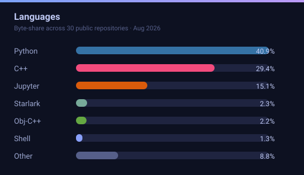

  

---

## 👋 Introduction

Hi — I'm **Muhammad Abdullah Ali**. I build the **infrastructure layer of applied AI**: quantized single-GPU LLM serving, geo-distributed retrieval pipelines over encrypted WAN meshes, and production multi-agent applications that ship to real users on real latency budgets.

Right now I'm a **Technical Lead on a 3-person AI team** at Data Precedes, where I architected a WhatsApp-first AI assistant (Next.js 16 · Mastra · Groq) with **sub-500ms webhook processing** and **620ms time-to-first-token**. I'm a BS Data Science student at **FAST-NUCES** (CGPA **3.73/4.00**, 6× Dean's List) who spends his nights pushing **245K-token context through a single RTX 3090** and auditing the literature for metric artifacts.

> **The one-line version:** I make expensive models cheap, distributed systems fast, and pipelines measurable — with numbers to prove it.

---

## 📈 Live Signals

| :---: | :---: |
| --- | --- |
|  |  |

---

## 🎯 By The Numbers

[-bb9af7?style=flat-square&labelColor=0d1121)](#)

---

## 🚀 Flagship Projects

### 🧠 Local LLM Serving & AVO Engine
vLLM · KVarN · DFlash2 · AutoRound · Node.js MCP · Goose · WSL2 — 🔒 code available on request

- **Single-GPU (RTX 3090 24 GB @ 250 W) serving recipe for Qwen3.8-27B** — W4A16 AutoRound weights, int8 heads/embeds, 2.7 GB vision tower stripped.
- **KVarN 4/2-bit KV cache → 245,760-token context in a 5.26 GiB pinned-memory budget**, verified byte-stable across `MAX_SEQS=2→8`.
- **DFlash2 speculative decoding: 130 tok/s decode** (up to 381 tok/s on structured reproduction, 32 tok/s at 112 k context) with **97.0% GSM8K** accuracy retained.
- **36× TTFT acceleration** (4.7 s vs. 169 s) on cached 100 k prefixes; production **Node.js MCP server suite** (`qwen_coworker`, `qwen_task`) bridging Claude Code / Antigravity orchestrators to local vLLM — long-poll wait server, disk-backed session resumption for KV reuse, 8-way concurrency semaphore.
- Validated end-to-end on **SWE-rebench** (50 post-cutoff issues): **32.0% resolved best-of-1**, 57.1% per-attempt within the 900 s budget — including patching 5 harness defects (one in upstream `eval.py`).

### 📱 Data Precedes AI Assistant — WhatsApp-First
Next.js 16 · React 19 · TypeScript · Mastra · Groq LLaMA 3.3 · Supabase · QStash · 🔒 code available on request

- **Led a 3-intern engineering team** as technical lead; **authored 86.4% of the repo's 309 commits**, architecting the core multi-agent service layer.
- **HMAC-verified WhatsApp Cloud API webhook with sub-500 ms processing**, queue-based deduplication, and parallel Groq Whisper STT — end-to-end voice turnaround under **4 s** with Opus synthesis and hallucination filtering.
- **3-agent Mastra orchestration with 429 auto-fallback hitting 620 ms TTFT over SSE**; 7-schedule QStash cron suite with per-user timezones.
- **768-dim embedding + centroid cosine-clustering memory engine** for recurring-task detection, universal dual-provider email ingestion (Gmail + Outlook Graph), and a **41-case evaluation harness** enforcing per-tier latency SLAs.

### 🌐 Geo-Distributed 3-Node Hybrid RAG Pipeline
Python · gRPC/Protobuf · FastAPI · AsyncIO · Tantivy BM25 · BGE-M3 (FP16) · Qdrant · WireGuard → [`ApatheticMioz/geo-distributed-hybrid-rag`](https://github.com/ApatheticMioz/geo-distributed-hybrid-rag)

- **Monolithic RAG decomposed into concurrent microservices over a WireGuard mesh**: Node C (async orchestrator with WAN-latency emulation) · Node A (dual HTTP/gRPC gateway) · Node B (dense retrieval worker).
- Node A fuses **Tantivy BM25 sparse + BGE-M3 dense retrieval** behind an `asyncio.Event` **160 ms barrier**, ranks via **Reciprocal Rank Fusion (k = 60)** with sparse-only fallback, and streams tokens over bidirectional gRPC.
- Node B runs **Qdrant gRPC ingestion with CUDA kernel warm-ups** to kill cold-start tail latency; automated TTFT profiling harness for the 2/3-node topology evolution.

### 🔬 Computational Pathology — Multi-Task U-Net & Metric Audit
PyTorch · Multi-Task U-Net · GradNorm · Macenko normalization · WandB · LaTeX → [`ApatheticMioz/cancer-pathology-dl`](https://github.com/ApatheticMioz/cancer-pathology-dl)

- **26-experiment reproducibility matrix** auditing joint **tumor classification (19 tissue types) + nuclear segmentation (5 categories)** against Rhanoui et al., *Onco* 2025, on H&E whole-slide imagery.
- **Shared-backbone multi-task U-Net with GradNorm dynamic loss balancing** that rescues collapsed baselines; paired ablations isolating gradient interference between macro-tumor and micro-glandular heads (<10 GB VRAM design target).
- **Original finding:** a literature-wide **metric-inflation artifact** in SIIM-ACR where **78% empty ground-truth masks** produce artificial **~99% Dice** via 0/0 edge cases — engineered isolated positive-mask evaluation protocols to expose true generalization.

---

## 🧩 Systems, Algorithms & Data (Public Labs)

| Repository | What's inside |
| :--- | :--- |
| [`hybridjoin-data-warehouse`](https://github.com/ApatheticMioz/hybridjoin-data-warehouse) | Near-real-time DWH: **HYBRIDJOIN stream-disk join, O(32 k) tuple memory, ~15 k records/s** on a 550 k-transaction dataset, 5-dimension star schema, producer→consumer→DB thread pipeline. |
| [`intelligent-cv-analyzer`](https://github.com/ApatheticMioz/intelligent-cv-analyzer) | FastAPI CV-screening engine implementing **Brute-Force / Rabin-Karp / KMP** string matching with live metric comparison; ranks candidates against 3 job profiles (KMP's O(n+m) wins for real-time screening). |
| [`shortest-path-algorithms-benchmark`](https://github.com/ApatheticMioz/shortest-path-algorithms-benchmark) | C++ benchmark suite: **Dijkstra vs A\* vs Bellman-Ford** with comparative profiling. |
| [`traffic-management-simulator-cpp`](https://github.com/ApatheticMioz/traffic-management-simulator-cpp) | Multi-threaded traffic-intersection simulator — **POSIX threads, mutexes, semaphores, IPC pipes**, deadlock-prevention analysis. |
| [`8086-pacman-adventure`](https://github.com/ApatheticMioz/8086-pacman-adventure) | Full **x86 MASM (Irvine32) game engine** — memory-mapped I/O, interrupt handlers, state machines at the register level. |
| [`cache-browser-sim-cpp`](https://github.com/ApatheticMioz/cache-browser-sim-cpp) | CPU cache simulator with **LRU/LFU replacement policies** and hit-ratio analytics. |
| [`disaster-resilience-analytics`](https://github.com/ApatheticMioz/disaster-resilience-analytics) | Fused **13 heterogeneous open-source datasets → 4,584 country-year records**; built DII / RRS / CRI composite resilience indices — and found the **Resilience Paradox**: governance quality (r = 0.78) out-predicts GDP per capita (r = 0.66). |
| [`pakistan-inflation-forecast`](https://github.com/ApatheticMioz/pakistan-inflation-forecast) | R time-series pipeline: **ARIMA / auto-ARIMA / regularized regression** (Elastic Net best) with full diagnostics. |

---

## 🛠️ Technical Arsenal

**LLM Inference & Systems**

**Machine Learning & Computer Vision**

**Full-Stack & Orchestration**

**Data Engineering & Analytics**

**Systems, Concurrency & Low-Level**

---

## 🎓 Academic & Professional Leadership

- <b>Technical Lab Demonstrator — 5 consecutive semesters, FAST-NUCES</b> (Fall 2024 → present): Programming Fundamentals, OOP, COAL (8086), Database Systems, Data Analytics — **1,800+ curated teaching files** and automated evaluation pipelines for cohorts of 40–55 students per section.
- <b>Class Representative, BS Data Science</b> (Fall 2023 → present) — primary liaison between student body and administration.
- <b>FDSS — FAST Data Science Society</b>: built and maintained the society's web platform (Datathon registration, 31-member leadership grid, photo galleries).
- <b>Competition record:</b> NASCON 2025 (Speed Programming & Bug Catcher) · Devathon by Devsinc, Lahore · EDATHON EDA challenge — plus a maintained <b>C++ competitive programming suite</b> (DP, number theory, graph theory, two-pointers) and a **2100 peak Chess.com rapid rating** (A-Level Chess Club founder & president).
- <b>Honors:</b> Bronze Medalist (Fall 2025) · Medalist (Spring 2026, 3.94 SGPA) · **6× Dean's List** · CGPA 3.73/4.00, expected graduation Aug 2027.

---

## 💼 Experience Timeline

- <b>AI Intern — Technical Lead · Data Precedes Inc.</b> <i>(Jun 2026 – present, Remote/Toronto)</i> — lead of 3-intern team; 86.4% of 309 commits; sub-500 ms webhook, 620 ms TTFT, 41-case eval harness.
- <b>Data Engineering Intern · Octopus Digital (Avanceon), ML Solutions</b> <i>(Jun – Aug 2025, Lahore)</i> — re-engineered a core ETL flow from **~20 min → ~5 s (99.6% latency reduction, 240×)**; refactored 7+ production Python/T-SQL pipelines; negotiated data contracts between warehouse and ML feature pipelines.
- <b>Technical Lab Demonstrator · FAST-NUCES</b> <i>(Fall 2024 – present)</i> — paid teaching role across 5 courses, ~100+ contact hours.
- <b>Freelance 3D Artist</b> <i>(ongoing)</i> — Blender / Premiere / Photoshop; paid 3D modeling for game developers + independent animation work.

---

## 🔗 Connect

---

Curious about the serving recipes, RAG architecture, or the pathology audit? <b><a href="mailto:m.abdullah.ali.2523@gmail.com?subject=Profile%20reach%20out">Reach out</a></b> — private codebases are shared with serious collaborators and recruiters.

🛠️ Hand-built with Markdown, shields.io, and home-rolled animated SVG — every number on this page is benchmarked, not estimated.

